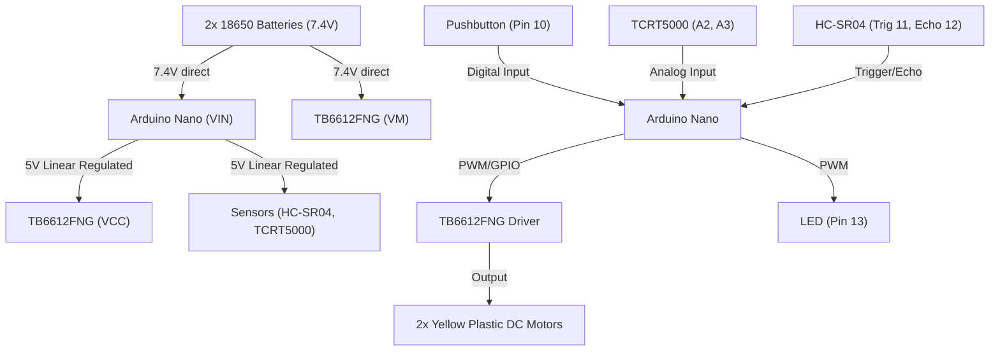

# Autonomous Minisumo Robot (10x10) - Design Specification

This document details the design and architecture for the autonomous minisumo robot built with an Arduino Nano, a TB6612FNG motor driver, a front-facing HC-SR04 ultrasonic sensor, and dual TCRT5000 line sensors.

## 1. System Architecture



### 1.1 Power Constraints & Regulatory Compliance
*   **Compliance:** Meets the "Amateur Category" regulation (no switching buck, step-down, or step-up regulators allowed).
*   **Configuration:** Power is provided by 2x 18650 Li-ion batteries in series (~7.4V nominal, ~8.4V max charge).
    *   **Logic (5V):** Arduino Nano regulates the 7.4V from its `VIN` pin to `5V` using its internal linear regulator. This `5V` rail powers the logic of the TB6612FNG (`VCC`), the TCRT5000 line sensors, and the HC-SR04 sensor.
    *   **Motors (7.4V):** The battery positive terminal is directly connected to the `VM` power pin of the TB6612FNG.
    *   **GND:** All components share a common ground (GND).

---

## 2. Hardware Pin Mapping

The microcontroller pins are assigned as follows:

| Component | Pin Name | Pin (Arduino Nano) | Mode | Description |
| :--- | :--- | :--- | :--- | :--- |
| **TB6612FNG** | `STBY` | `D8` | Output | Standby Control (Active High) |
| | `AIN1` | `D7` | Output | Motor A Control 1 |
| | `AIN2` | `D6` | Output | Motor A Control 2 |
| | `PWMA` | `D5` | Output (PWM) | Motor A Speed Control |
| | `BIN1` | `D4` | Output | Motor B Control 1 |
| | `BIN2` | `D2` | Output | Motor B Control 2 |
| | `PWMB` | `D9` | Output (PWM) | Motor B Speed Control |
| **HC-SR04** | `TRIG` | `D11` | Output | Ultrasonic Trigger |
| | `ECHO` | `D12` | Input | Ultrasonic Echo |
| **TCRT5000** | `TCRT_LEFT` | `A2` | Input (Analog) | Left Line Sensor |
| | `TCRT_RIGHT` | `A3` | Input (Analog) | Right Line Sensor |
| **User Interface** | `BUTTON` | `D10` | Input (Pull-up) | Mode Activation Button |
| | `LED` | `D13` | Output | Status LED Indicator |

---

## 3. Finite State Machine (FSM)

The control logic runs as a non-blocking loop utilizing a Finite State Machine (FSM). 

```mermaid
stateDiagram-v2
    [*] --> STANDBY : Power On
    
    STANDBY --> SAFETY_DELAY : Button Pressed (Pin 10 == LOW)
    note right of STANDBY
        Motors: OFF
        LED: OFF
    end note

    SAFETY_DELAY --> INITIAL_TACTIC : Timeout >= 5000 ms
    note right of SAFETY_DELAY
        Motors: OFF
        LED: Blinking (5Hz)
    end note

    INITIAL_TACTIC --> SEARCH : Opponent Seen OR Timeout >= 400 ms
    INITIAL_TACTIC --> EVADE_LEFT : Left Line Detected
    INITIAL_TACTIC --> EVADE_RIGHT : Right Line Detected
    note right of INITIAL_TACTIC
        Motors: Spin to find opponent
        LED: Steady ON
    end note

    SEARCH --> ATTACK : Opponent Seen (Distance < 50cm)
    SEARCH --> EVADE_LEFT : Left Line Detected
    SEARCH --> EVADE_RIGHT : Right Line Detected
    note right of SEARCH
        Motors: Search rotation / arc
        LED: Steady ON
    end note

    ATTACK --> SEARCH : Opponent Lost (Distance >= 50cm)
    ATTACK --> EVADE_LEFT : Left Line Detected
    ATTACK --> EVADE_RIGHT : Right Line Detected
    note right of ATTACK
        Motors: Forward 100%
        LED: Steady ON
    end note

    EVADE_LEFT --> SEARCH : Evade Done (Time Elapsed)
    EVADE_RIGHT --> SEARCH : Evade Done (Time Elapsed)
    note bottom of EVADE_LEFT
        Motors: Back & Right
    end note
    note bottom of EVADE_RIGHT
        Motors: Back & Left
    end note
```

### 3.1 State Descriptions

1.  **`STANDBY`**
    *   **Behavior:** Motors are stopped (`STBY` pin `LOW`). LED is `LOW`.
    *   **Transition:** Checks if the button is pressed (transitions when pin reads `LOW`).
2.  **`SAFETY_DELAY`**
    *   **Behavior:** Counts up to 5000 ms. LED toggles state every 100 ms (non-blocking using `millis()`). Motors remain off.
    *   **Transition:** After 5000 ms, transitions to `INITIAL_TACTIC`.
3.  **`INITIAL_TACTIC`**
    *   **Behavior:** LED is set to `HIGH` (steady ON). Robot spins on its axis (e.g. Left Motor Forward, Right Motor Backward) searching for the opponent.
    *   **Transition:** If the ultrasonic sensor detects an obstacle `< 50 cm`, it immediately transitions to `ATTACK`. If `400 ms` pass without detection, it transitions to `SEARCH`. If a white border is touched, it goes to the corresponding evasion state.
4.  **`SEARCH`**
    *   **Behavior:** Spins slowly or drives in a searching arc to scan the Dohyo.
    *   **Transition:** Transitions to `ATTACK` if the ultrasonic distance reads `< 50 cm`. Goes to `EVADE_LEFT` or `EVADE_RIGHT` if line sensors detect white.
5.  **`ATTACK`**
    *   **Behavior:** Runs both motors forward at 100% speed.
    *   **Transition:** Transitions back to `SEARCH` if the distance reading rises above `50 cm` (opponent lost). Transitions to `EVADE_LEFT` or `EVADE_RIGHT` if white line is detected.
6.  **`EVADE_LEFT` / `EVADE_RIGHT`**
    *   **Behavior:** Immediate priority interrupt. Backward movement followed by a sharp turn in the opposite direction.
    *   **Transition:** After a predefined duration (e.g., 250 ms backward + 200 ms turn), returns to `SEARCH`.

---

## 4. Subsystem Implementation Details

### 4.1 Non-Blocking Ultrasonic Scanning
To prevent blocking the execution loop, the ultrasonic measurement utilizes a short timeout on the `pulseIn` function:
*   Standard `pulseIn` defaults to a `1,000,000` microsecond (1s) timeout, which would freeze the robot.
*   We use a timeout of `6000` microseconds.
    *   Speed of sound is $\approx 343 \text{ m/s} = 0.0343 \text{ cm/\mu s}$.
    *   A roundtrip of 6000 $\mu s$ corresponds to:
        $$\text{Distance} = \frac{6000 \times 0.0343}{2} \approx 102.9 \text{ cm}$$
    *   If no echo is received within 6000 $\mu s$ (meaning no object within 1 meter), `pulseIn` returns 0.
    *   This keeps loop latency under $6 \text{ ms}$.

### 4.2 Line Sensors (TCRT5000) Calibration
*   TCRT5000 analog values:
    *   **Black Dohyo (Low reflectivity):** High sensor voltage/reading (approaching 1023).
    *   **White Border (High reflectivity):** Low sensor voltage/reading (approaching 0).
*   **Thresholding:** A configurable threshold (e.g. `400`) will be used to detect the line. A reading below this threshold indicates white line detection.

### 4.3 TB6612FNG Motor Control Truth Table

| STBY | AIN1/BIN1 | AIN2/BIN2 | PWM | Motor State |
| :--- | :--- | :--- | :--- | :--- |
| `LOW` | `X` | `X` | `X` | Standby (Coast/Off) |
| `HIGH`| `HIGH` | `LOW` | `SPEED` | Forward at `SPEED` |
| `HIGH`| `LOW` | `HIGH` | `SPEED` | Backward at `SPEED` |
| `HIGH`| `HIGH` | `HIGH` | `X` | Brake |
| `HIGH`| `LOW` | `LOW` | `X` | Coast (Off) |
